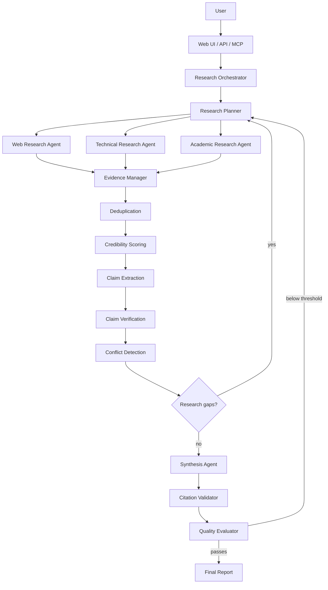

# ResearchForge

**Multi-Agent Deep Research, Built for Evidence.**

ResearchForge takes a research question, plans it into subquestions, researches them in
parallel with specialized agents, normalizes and scores everything it finds as evidence,
extracts and verifies claims against that evidence, detects conflicts instead of hiding them,
iterates when coverage is thin, and produces a cited, quality-scored report — via a FastAPI
HTTP API, an MCP server, and a web UI.

It is a from-scratch redesign of a small (~260-line) CrewAI/LinkUp/FastMCP/Streamlit teaching
demo, used only as inspiration — see [Attribution](#attribution) and
[`docs/reference-analysis.md`](docs/reference-analysis.md) for exactly what changed and why.

> **Status:** this is a from-scratch implementation written end-to-end. The unit suite has
> been exercised in the repository environment; integration/e2e execution still depends on the
> declared runtime dependencies. See
> [Status: what's verified vs. not](#status-whats-verified-vs-not) and
> [`docs/PROGRESS.md`](docs/PROGRESS.md) for the precise, honest breakdown, and exactly which
> commands to run to verify it yourself.

## Why this project exists

Most "multi-agent research" demos wire a few LLM personas together with free-text prompts and
call it done. That approach can't answer the question that actually matters:
**why should I believe this, and where exactly did it come from?** ResearchForge exists to
answer that question by making evidence, claims, and citations first-class typed data that a
verification pipeline can act on — not just prose an LLM produced about itself.

## Architecture



Full layer-by-layer breakdown, dependency rules, and the job state machine:
[`docs/ARCHITECTURE.md`](docs/ARCHITECTURE.md). Coding standards and rules for extending the
project: [`CLAUDE.md`](CLAUDE.md).

## Features

- **Typed contracts everywhere** — Pydantic models (`Evidence`, `Claim`, `ResearchPlan`,
  `ResearchReport`, …) are the only thing that crosses a layer boundary. No free-text hand-offs.
- **Parallel, fault-tolerant research** — `asyncio`-based execution with concurrency limits,
  per-task timeouts, retries with backoff, and graceful partial failure (one bad source never
  fails the whole job).
- **Evidence pipeline** — normalization, exact + near-duplicate detection, and an *explainable*
  0–100 credibility score (never a bare number — every score ships with its reasons).
- **Claim verification** — extraction, corroboration-aware confidence scoring, and conflict
  detection that surfaces disagreement instead of averaging it away.
- **Citation validation** — citation IDs in claims are checked against evidence actually
  retrieved for that job; nonexistent evidence IDs are rejected. Semantic support between a
  citation and generated prose is not yet guaranteed, and coverage is reported as a checked
  percentage.
- **Iterative research** — gaps (unsupported important claims) trigger follow-up research tasks,
  bounded by the active mode's iteration cap.
- **Explainable quality scoring** — 8-dimension 0–100 quality score, with the evaluator able to
  recommend another iteration.
- **Three research modes** — QUICK / DEEP / EXHAUSTIVE, each a `ResearchModeConfig`, not an
  `if`-branch (see [Research modes](#research-modes)).
- **Provider abstraction** — swap search or LLM backends via environment variables; **the whole
  system runs with zero API keys** using deterministic mock providers.
- **FastAPI + SSE** — REST API with a live Server-Sent-Events progress stream.
- **MCP server** — six typed tools, sharing the same orchestration path as the HTTP API.
- **Next.js frontend** — dashboard, live research workspace, report view, history.
- **Persistence** — SQLite by default, Postgres-ready via `DATABASE_URL`.
- **Tests, evaluation harness, Docker, CI** — see their respective sections below.

## Agent architecture

| Agent | Responsibility | File |
|---|---|---|
| Research Planner | Decomposes a query into a typed `ResearchPlan` + follow-up tasks from gaps | `agents/planner.py` |
| Web Research Agent | General web information and primary sources | `agents/web_researcher.py` |
| Technical Research Agent | GitHub, docs, engineering blogs, benchmarks | `agents/technical_researcher.py` |
| Academic Research Agent | Papers, institutional/scientific sources | `agents/academic_researcher.py` |
| Fact Checker | Extracts claims per task, verifies against all evidence | `agents/fact_checker.py` |
| Synthesizer | Produces executive summary, analysis, findings, limitations | `agents/synthesizer.py` |
| Quality Evaluator | Deterministic 8-dimension quality score, recommends iteration | `agents/evaluator.py` |

All three research agents share one implementation (`agents/researcher.py`) with a
domain-specific query suffix, rather than three copies of the same search-and-normalize loop.
Evidence extraction is deterministic code (`evidence/manager.py`) fed by those three agents,
rather than a separate "evidence analyst" LLM persona — see
[`docs/IMPLEMENTATION_PLAN.md`](docs/IMPLEMENTATION_PLAN.md#scope-decisions-made-during-implementation)
for why.

## Research workflow

1. **Plan** — the planner LLM call produces 2–7 non-redundant, independently-researchable
   subquestions (bounded by mode).
2. **Research** — subquestions are dispatched to the right domain agent and run concurrently
   (`orchestration/execution.py`), each with its own timeout/retry budget.
3. **Evidence pipeline** — results are normalized, deduplicated (exact + near-duplicate via
   token-shingle Jaccard similarity), and credibility-scored with corroboration counted across
   the whole evidence pool.
4. **Claims** — extracted per task, then verified against the *entire* evidence pool (not just
   their own task's evidence) so cross-task corroboration and conflicts are caught.
5. **Gap check** — important claims that are still unsupported/partially-supported become
   follow-up research tasks; the loop repeats up to the mode's `max_iterations`.
6. **Synthesis** — an LLM call produces the narrative sections; findings, limitations, and the
   confidence assessment are derived deterministically from the verified claims.
7. **Citation validation** — every citation is checked against real, retrieved evidence.
8. **Quality scoring** — 8-dimension explainable score; below threshold + iterations remaining
   loops back to step 1 with the identified gaps.

## Evidence pipeline

See [`docs/ARCHITECTURE.md#evidence--claim--citation-pipeline`](docs/ARCHITECTURE.md) and
[`docs/ARCHITECTURE.md#credibility`](docs/ARCHITECTURE.md) for the full signal table. In short:
source type, domain reputation tier, recency, corroboration, and directness combine into a
0–100 score, and the reasons are always attached (`evidence/credibility.py`).

## Claim verification

`SUPPORTED` / `PARTIALLY_SUPPORTED` / `CONFLICTING` / `UNSUPPORTED`, computed from the balance
of supporting vs. conflicting evidence and each item's credibility
(`verification/confidence.py`). Conflict detection is a documented lexical heuristic (shared
subject + negation markers), not semantic entailment — a real limitation, stated plainly rather
than hidden (see [Limitations](#limitations)).

## Citation validation

`citations/validator.py` checks that every citation on a `SUPPORTED`/`PARTIALLY_SUPPORTED` claim
resolves to an `Evidence.evidence_id` that was actually retrieved for that job, and computes a
real coverage percentage — the system does not report 100% unless every citation actually
checked out.

## Quality scoring

8 dimensions (evidence coverage, source quality, source diversity, claim support, citation
coverage, contradiction handling, completeness, freshness), weighted into a 0–100 overall score,
always with human-readable notes (`evaluation/evaluator.py`). Distinct from the offline
benchmark harness at the repo root — see [`docs/EVALUATION.md`](docs/EVALUATION.md).

## Research modes

| Mode | Max tasks | Parallelism | Max iterations | Quality threshold |
|---|---|---|---|---|
| `quick` | 2 | 2 | 1 | 55 |
| `deep` (default) | 4 | 4 | 2 | 70 |
| `exhaustive` | 7 | 5 | 4 | 82 |

Defined as data in `orchestration/modes.py::MODE_CONFIGS` — no mode-specific branching in the
orchestrator itself.

## Provider architecture

Nothing outside `providers/` imports a vendor SDK directly. Orchestration and agents depend only
on the `SearchProvider` / `LLMProvider` interfaces (`providers/base.py`,
`providers/llm/base.py`); `providers/factory.py` is the single place that turns settings into a
live instance — and it **always falls back to the mock provider and logs why** if a configured
provider is missing its API key, rather than silently pretending to be live.

| Provider | File | Enable with |
|---|---|---|
| Mock search (default) | `providers/mock.py` | nothing — always available |
| LinkUp | `providers/linkup.py` | `RESEARCHFORGE_SEARCH_PROVIDER=linkup`, `RESEARCHFORGE_LINKUP_API_KEY`, `pip install linkup-sdk` |
| Bright Data | `providers/brightdata.py` | `RESEARCHFORGE_SEARCH_PROVIDER=brightdata`, `RESEARCHFORGE_BRIGHTDATA_API_KEY` (+ optional `RESEARCHFORGE_BRIGHTDATA_ZONE`) |
| Mock LLM (default) | `providers/llm/mock.py` | nothing — always available |
| Anthropic | `providers/llm/anthropic.py` | `RESEARCHFORGE_LLM_PROVIDER=anthropic`, `RESEARCHFORGE_ANTHROPIC_API_KEY`, `pip install anthropic` |
| OpenAI (and compatible) | `providers/llm/openai.py` | `RESEARCHFORGE_LLM_PROVIDER=openai`, `RESEARCHFORGE_OPENAI_API_KEY`, `pip install openai` |
| Ollama (local) | `providers/llm/ollama.py` | `RESEARCHFORGE_LLM_PROVIDER=ollama`, `RESEARCHFORGE_OLLAMA_BASE_URL` |
| Gemini | *not implemented* | see [Limitations](#limitations) — the interface supports it, no adapter was written |

Bright Data is integrated via its REST SERP + Web Unlocker APIs rather than proxying Bright
Data's own MCP server from inside ResearchForge's MCP server — see the module docstring in
`providers/brightdata.py` for the reasoning; swapping to their MCP server later is a new
`SearchProvider` implementation, not an orchestration change.

Per-task LLM model routing (planner / extraction / fact-check / synthesis can each use a
different model id) is configured via `RESEARCHFORGE_*_MODEL` env vars — see `.env.example`.

## MCP

Six typed tools — `research`, `research_status`, `get_research`, `get_sources`, `verify_claim`,
`get_research_history` — sharing the HTTP API's orchestration/persistence path. Full contract,
example client config, and error-handling behavior: [`docs/MCP.md`](docs/MCP.md).

## API

FastAPI app (`api/app.py`), OpenAPI docs at `/docs` once running.

| Method | Path | Purpose |
|---|---|---|
| POST | `/api/research` | Start a research job |
| GET | `/api/research/{id}` / `/status` | Job status + plan |
| GET | `/api/research/{id}/sources` | Collected evidence |
| GET | `/api/research/{id}/claims` | Extracted + verified claims |
| GET | `/api/research/{id}/report` | Final report (409 until ready) |
| GET | `/api/research/{id}/events` | SSE live progress stream |
| GET | `/api/research/history` | Past jobs |
| POST | `/api/claims/verify` | Verify an arbitrary claim, ad hoc or against a job |
| GET | `/api/health` | Status + which providers are actually active |

Security: request-body size limit, CORS restricted to configured origins, a global exception
handler that never leaks stack traces, and Pydantic validation on every request body.

## Streaming

Server-Sent Events, not WebSockets — the event flow is one-directional (server → client), which
is what SSE is for with far less infrastructure. Events: `research_started`, `plan_created`,
`task_started`, `source_found`, `evidence_added`, `claim_extracted`, `research_iteration_started`,
`research_gap_detected`, `synthesis_started`, `citation_validation`, `quality_evaluation`,
`research_completed` / `research_failed`, plus periodic `keepalive` frames.

## Frontend

Next.js 14 (App Router) + TypeScript + Tailwind, in `frontend/`:

- **Dashboard** (`/`) — new-research form with mode selector, recent-jobs summary
- **Research workspace** (`/research/[id]`) — live SSE-driven progress, tabs for overview
  (plan + event timeline + agent activity), sources, claims (+ ad hoc claim verification), and
  the final report once ready
- **History** (`/history`) — every past job, filterable by mode
- `loading.tsx` / `error.tsx` / `not-found.tsx` — proper loading/error/empty states

`frontend/src/lib/types.ts` mirrors the backend Pydantic models by hand (no codegen pipeline was
set up in this pass — see [Roadmap](#roadmap)); `frontend/src/lib/api.ts` is the REST + SSE
client.

## Setup

### Prerequisites

Python 3.11+, Node.js 20+ (frontend only). No API keys required to run anything.

### Local development

```bash
git clone <this-repo>
cd researchforge
cp .env.example .env
make install     # pip install -e ".[dev,anthropic,openai,linkup]" + npm install in frontend/
make run          # FastAPI on http://localhost:8000  (docs: /docs)
make frontend      # in another shell: Next.js on http://localhost:3000
make mcp            # in another shell, optional: MCP server over stdio
```

With the default `.env`, `/api/health` will report both providers as `mock` — that's expected,
not a bug; see [Provider architecture](#provider-architecture) to enable a real one.

### Environment variables

Full reference: [`.env.example`](.env.example). Everything has a mock-safe default; you only
need to set values for providers you actually want to make live.

### Docker

```bash
docker compose up --build
```

Backend on `:8000`, frontend on `:3000`, SQLite persisted to a named volume. Pass real provider
keys via a `.env` file in the repo root (docker-compose reads them through
`${RESEARCHFORGE_*_API_KEY:-}` substitutions) — see `docker-compose.yml`.

**Not run in the authoring sandbox** (no Docker daemon available there) — see
[Status](#status-whats-verified-vs-not).

## Running tests

```bash
make test          # pytest -q — unit + integration + e2e, mock providers, no network
make test-cov       # with coverage
```

Unit (dedup, credibility, confidence/claim-status, citation validation, quality evaluator,
modes, mock search provider, planner, evidence manager), integration (full orchestrator run,
FastAPI app via `httpx.ASGITransport`, MCP tool bodies), and one e2e lifecycle test that submits
research through the real API and checks the report's citations all resolve to real evidence.
All tests use `MockSearchProvider` / `MockLLMProvider` and an in-memory SQLite DB — no network,
no API keys, ever required.

**Written and statically reviewed; not executed in the authoring sandbox** (no `pip install`
available there — see [Status](#status-whats-verified-vs-not) for exactly what that means and
the commands to run them yourself).

## Running evaluation

```bash
make evaluate
# equivalently:
python evaluation/benchmark.py                       # mock providers, all questions
python evaluation/benchmark.py --live                  # use your configured real providers
python evaluation/benchmark.py --output results.json    # write full JSON results
```

Runs a small labeled dataset (`evaluation/datasets/benchmark.json`) across technology
comparison, product comparison, scientific, historical, software architecture, and
current-events-style questions, and reports pass rate + per-dimension averages. Details and
what the numbers do/don't prove: [`docs/EVALUATION.md`](docs/EVALUATION.md).

## Example research query

```bash
curl -X POST http://localhost:8000/api/research \
  -H "Content-Type: application/json" \
  -d '{"query": "Compare the current approaches to building AI coding agents. Analyze their architectures, tool-use patterns, memory strategies, strengths, weaknesses, and recent developments. Cite primary technical sources where possible.", "mode": "deep"}'
```

Poll `/api/research/{id}/status` (or open `http://localhost:3000/research/{id}` once the
frontend is running) until `status` is `completed`, then `GET /api/research/{id}/report`. With
mock providers this produces a structurally complete report — plan, deduplicated/scored
evidence, verified claims, validated citations, and an explainable quality score — with
deterministic placeholder content (see `providers/mock.py`, `providers/llm/mock.py`) rather than
real facts about AI coding agents. Configure a real search + LLM provider for substantively
real output.

## Project structure

```
src/researchforge/
  api/            FastAPI app, schemas, routes (research, claims, health)
  mcp/            FastMCP server + tool implementations
  orchestration/  Job lifecycle, state machine, parallel execution, mode configs
  agents/         Planner, 3 research agents, fact checker, synthesizer, evaluator
  evidence/       Normalization, deduplication, credibility, ranking
  verification/   Claim extraction, confidence/status, conflict detection
  citations/      Validation + report formatting
  evaluation/     Live quality scorer (distinct from evaluation/ at repo root)
  providers/      SearchProvider / LLMProvider interfaces + adapters
  storage/        SQLAlchemy models, async engine, repositories
  models/         Pydantic domain models (the shared typed vocabulary)
  observability/  Structured JSON logging, in-process metrics
  config/         Settings (env-driven, mock-safe fallbacks)
tests/            unit/ integration/ e2e/
evaluation/        benchmark.py, metrics.py, datasets/benchmark.json, README.md
frontend/          Next.js app
docs/              ARCHITECTURE, IMPLEMENTATION_PLAN, DEVELOPMENT, MCP, EVALUATION,
                   reference-analysis, PROGRESS
```

## Observability

Structured JSON logging (`observability/logging.py`) — event-first (`logger.info("event_name",
field=value)`), with an active safety-net redaction of any field whose key looks secret-shaped.
In-process metrics registry (`observability/metrics.py`) tracks task duration, success/failure
counts, and is durable-sink-ready via `storage/models.py::MetricRecord`. LLM adapters that
expose usage (Anthropic, OpenAI) report input/output tokens and an estimated cost per call
(`providers/llm/*.py::LLMUsage`); Ollama reports zero cost (local inference).

## Security

- Secrets only via environment variables; `.env` is git-ignored; `.env.example` contains no real
  keys.
- Structured logging actively redacts any field whose key contains `api_key`, `token`, `secret`,
  `password`, or `authorization`.
- Global FastAPI exception handler never returns a stack trace to the client.
- Request bodies are size-limited (`BodySizeLimitMiddleware`) and validated by Pydantic before
  touching business logic.
- CORS restricted to configured origins (`RESEARCHFORGE_CORS_ALLOWED_ORIGINS`).
- No `eval`/`exec` anywhere in the codebase; no MCP tool accepts code, shell commands, or file
  paths as input (see `docs/MCP.md#what-this-mcp-server-deliberately-does-not-expose`).
- Docker images run as a non-root user.
- CI runs entirely on mock providers — no secrets are ever needed by or exposed to CI.

## Status: what's verified vs. not

This was authored in a sandbox with **no package-index, Docker, or npm-registry access**. To be
precise about what that does and doesn't mean:

- **Written**: every file in this repository is complete, real implementation — no
  `# TODO: implement this` placeholders in core functionality.
- **Statically reviewed**: imports, names, and cross-module contracts were checked by re-reading
  the code, not by running a type checker or import graph tool.
- **Verified**: the complete unit suite passes in this environment; integration/e2e tests require the declared SQLite async driver.
- **Not yet fully verified**: end-to-end FastAPI/MCP production boot, frontend build, and Docker
  `npm install`/`next build`, no `docker build`/`compose up`, no GitHub Actions run.

See [`docs/PROGRESS.md`](docs/PROGRESS.md) for the itemized, continuously-updated status and the
exact commands to run locally to verify everything yourself — please run them before treating
this as working software; static review reduces but does not eliminate the chance of a bug that
only execution reveals.

## Limitations

- **Conflict detection is lexical, not semantic** — shared-subject + negation-marker heuristic
  (`verification/conflicts.py`), not an NLI model. It will miss subtler disagreements and can
  false-positive on genuine negation that isn't actually a conflict.
- **Claim-to-evidence linking is lexical overlap**, not embeddings/semantic similarity — cheap
  and dependency-free, but less precise than a real retrieval model would be.
- **No PDF report export** — Markdown, JSON, and HTML (via the API's JSON response rendered
  client-side) are supported; PDF is not.
- **No Alembic migrations** — schema changes during development mean dropping the local SQLite
  file (see `docs/DEVELOPMENT.md`).
- **No Gemini adapter** — the `LLMProvider` interface supports it and `LLMProviderName.GEMINI`
  exists in settings, but no concrete adapter was written.
- **Frontend types are hand-mirrored**, not generated from the OpenAPI schema — they can drift;
  see Roadmap.
- **This has not been executed** — see the section above. Treat it as thoroughly-written,
  unverified code until you've run it.

## Roadmap

- Generate frontend types from the FastAPI OpenAPI schema instead of hand-mirroring them.
- Real semantic claim-evidence linking and conflict detection (embeddings or an NLI model).
- PDF report export.
- Alembic migrations for schema evolution.
- Gemini LLM adapter.
- Durable, queryable metrics sink wired to `storage/models.py::MetricRecord` (currently defined
  but not yet written to from the in-process registry).

## Attribution

ResearchForge is inspired by the `Multi-Agent-deep-researcher-mcp-windows-linux` example from
the `ai-engineering-hub` repository — a ~260-line CrewAI + LinkUp + FastMCP + Streamlit teaching
demo. No code from that project is reused; ResearchForge is a from-scratch redesign. See
[`docs/reference-analysis.md`](docs/reference-analysis.md) for a full breakdown of what was kept
conceptually, what changed, and why.

## License

MIT — see [`LICENSE`](LICENSE).
