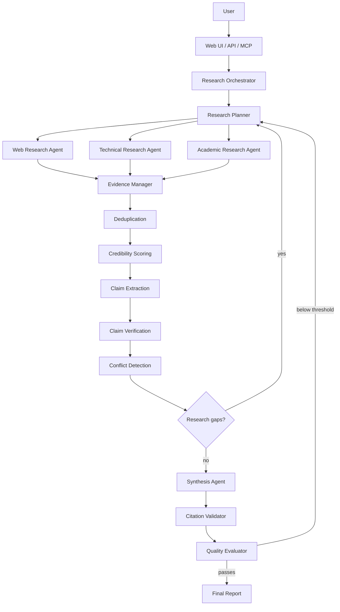

# ResearchForge Architecture

## High-level flow



## Layers and boundaries

```
api/            HTTP surface (FastAPI). Talks only to orchestration + storage.
mcp/            MCP tool surface. Talks only to orchestration + storage.
orchestration/  Owns the research job lifecycle, state machine, and event stream.
agents/         Stateless "roles" — pure functions of (task, context) -> typed output,
                using an LLMProvider + SearchProvider injected at construction.
evidence/       Normalization, dedup, ranking, credibility scoring.
verification/   Claim extraction, fact-checking, conflict detection, confidence.
citations/      Citation validation + formatting for report output.
evaluation/     Research *quality* scoring (0-100) — distinct from evaluation/ at repo root,
                which is the offline benchmark harness for ResearchForge itself.
providers/      SearchProvider / LLMProvider interfaces + adapters (mock, linkup, brightdata,
                anthropic, openai, ollama).
storage/        SQLAlchemy models + repositories. The only layer allowed to hold a DB session.
models/         Pydantic models shared across every layer above. No behavior, just shape.
observability/  Structured logging + metrics collection, imported everywhere but depends on
                nothing else in the project.
```

Dependencies point inward toward `models/`; `models/` depends on nothing else in the project.
`api/` and `mcp/` are thin adapters over the same `orchestration.Orchestrator` — neither
contains research logic.

## Why this is better than "one big agents.py"

The reference project's failure mode is that intelligence and control flow are entangled: the
CrewAI `Task` descriptions *are* the orchestration logic, expressed as prompts. That makes the
system's behavior only inspectable by reading LLM output, and untestable without live model
calls. Splitting into the layers above means:

- **Orchestration is deterministic code**, testable with mocked agents.
- **Agents are swappable and individually testable** — an agent is "take typed input, call a
  provider, return typed output," nothing more.
- **Evidence/claims/citations are data**, not paragraphs, so downstream consumers (UI, quality
  evaluator, citation validator) can reason about them programmatically instead of re-parsing
  prose.

## Research job state machine

```
PENDING -> PLANNING -> RESEARCHING -> ANALYZING -> (ITERATING <-> RESEARCHING)
         -> SYNTHESIZING -> VALIDATING -> COMPLETED
                                        -> FAILED (on unrecoverable error)
                                        -> PARTIAL (on partial failure past a mode's tolerance)
```

State transitions are recorded in `orchestration/state.py::ResearchState`. The registry
persists explicit checkpoints after planning, evidence/analysis, claims, and terminal/report
stages; this provides durable progress without committing every in-memory mutation. Persisted
events can be replayed by the SSE endpoint after a process restart, although resuming execution
itself is not implemented.

## Concurrency model

`orchestration/execution.py` runs independent research tasks with `asyncio.gather` under a
`asyncio.Semaphore(mode.max_parallelism)`, wraps each task in `asyncio.wait_for(..., timeout)`,
and retries transient provider errors with exponential backoff (`observability` records each
attempt). A task that exhausts retries is recorded as a failed task with its partial output (if
any) kept; it does not raise out of the batch — `asyncio.gather(..., return_exceptions=True)` is
used and exceptions are converted into `TaskResult(status=FAILED)` records.

## Evidence → Claim → Citation pipeline

1. **Evidence** is the atomic unit: one retrieved/extracted source, normalized into the
   `Evidence` model with a `credibility_score` (see `docs/ARCHITECTURE.md#credibility`) and
   `relevance_score`.
2. **Deduplication** collapses exact URL duplicates and near-duplicates (via a token-shingle
   Jaccard-similarity check on title+summary — see `evidence/deduplication.py`) so that five
   copies of the same syndicated article do not count as five independent sources.
3. **Claims** are extracted per research task from the surviving evidence set, each claim
   carrying `supporting_evidence_ids` / `conflicting_evidence_ids`.
4. **Verification** assigns a status (`SUPPORTED` / `PARTIALLY_SUPPORTED` / `CONFLICTING` /
   `UNSUPPORTED`) from the balance of supporting vs. conflicting evidence and each piece's
   credibility — see `verification/confidence.py` for the exact formula.
5. **Citations** in the synthesized report are validated against the evidence store: a citation
   must reference a real `Evidence.evidence_id` that was actually retrieved for this job.

## Credibility scoring {#credibility}

`evidence/credibility.py::score_credibility` combines explainable signals into a 0-100 score:

| Signal | Weight | Notes |
|---|---|---|
| Source type (primary docs/standards > reputable news > blog > forum) | 30 | from `SourceType` enum |
| Domain reputation tier (configurable allow/deny/neutral lists) | 20 | `config/settings.py::DOMAIN_REPUTATION` |
| Recency | 15 | decays based on `publication_date` if present |
| Corroboration | 20 | count of independent (different-domain) sources making the same claim |
| Directness | 15 | primary-source vs. reporting-about-a-source, heuristic on extracted content |

The function returns `(score, reasons: list[str])` — the API and UI always render both.

## Quality evaluation

`evaluation/evaluator.py::QualityEvaluator` (inside `src/researchforge/`, the *live* research
quality scorer — not to be confused with the repo-root `evaluation/` benchmark harness) computes
a weighted 0-100 score from: evidence coverage, source quality, source diversity, claim support
ratio, citation coverage, contradiction handling, completeness, and freshness. If the score is
below the active mode's `quality_threshold` and iterations remain, the orchestrator loops back
to planning with the identified gaps as new subquestions.

## Frontend

A minimal Next.js (App Router, TypeScript) app in `frontend/` consumes the FastAPI SSE stream
directly (`EventSource`) and the REST endpoints for history/reports. It intentionally ships a
smaller page set than the full spec (dashboard, research, workspace/report) rather than a large
number of half-built screens — see `docs/PROGRESS.md` for exactly what's implemented.
